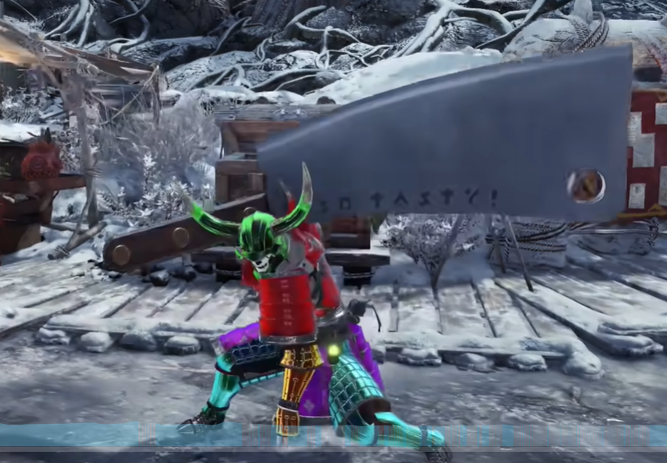
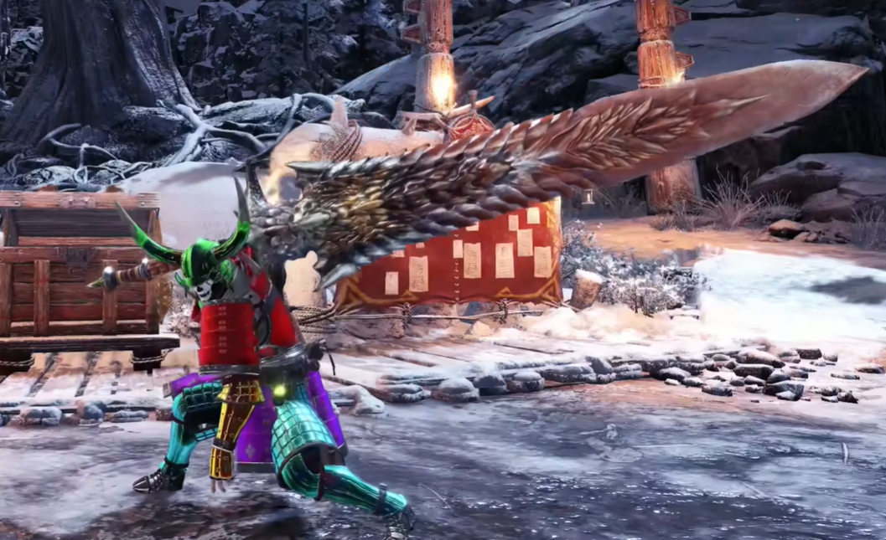

# 大剑模型分享

---

分享来自B站up：

[@AMEKAJI航](https://space.bilibili.com/9195944)

视频链接：

[MHWI 高材质！66把真正的怪物猎人大剑mod分享！总有一把你爱的](https://www.bilibili.com/video/BV1QK421y7ob/?spm_id_from=333.1007.top_right_bar_window_custom_collection.content.click&vd_source=4e3f9bb7f0435243577a1561f8cf0828)

>视频简介：  东西是N网的，但不是直接下载就能用的，是替换的武器树模组，我们这边是把武器单个拆分出来的，花了大量的时间和精力，本来只是我个人群里在用的，但是一直被问这是什么MOD之类的，也有人私聊我说愿意花钱之类的，钱肯定是不能收的，时间也很久了，索性就一起发了跟大家一起分享吧。  安装说明:需要用到最新的狩猎盒子，为了大家方便拆分的时候也都弄好了，任意武器可替换任意模型，需要自行替换

下载链接：

[百度网盘链接](https://pan.baidu.com/s/1hBaol2qfoCb6FajfxjxAtA?pwd=AMKJ)

提取码：

AMKJ

---

# 目录

[toc]

---

## 灭尽龙

## 爆锤龙

## b毒龙

## 冰属性

## 冰鱼龙

## 波波

## 菜刀

## 大马士革

## 水果刀

## 大凶e龙

## 凯罗大剑

## 帝王金大剑

## 电锯

## 冻鱼

## 毒妖鸟 锯子

## 飞雷龙

## 浮空龙

## 浮眠龙

## 骨锤龙

## 黑带大剑

## 角龙

## 黑角

## 角龙2

## 爆鳞龙

## 红莲爆鳞龙

## 歼世灭尽龙

无特效，但替换恐暴龙大剑后有龙特效（？）

## 冥灯龙

## 机械大剑

搭配合金套

## 老山龙

## 雷鄂龙

## 雷狼龙

## 狱狼龙

## 龙鄂剑

## 风化大剑？

## 猫的一把？？

## 猛牛龙

## 冥灯龙2

## 冥灯龙3（不是这个包里的）？

## 溟波龙

## 木桩大剑

## 泥鱼龙

## 仁剑侠客行（拳头）

## 熔山龙

## 熔岩龙（烤鱼）

## 奢华大剑

## 风漂龙

## 霜翼风飘

## 水妖鸟

## 碎龙

有个呼吸灯的效果

## 土砂龙

## 雾瘴尸套龙

## 锈块大剑？

## 迅龙

## 岩贼龙（肥宅）

## 炎王龙

## 雌火龙

## 樱火龙

## 金火龙

## 锈块升级版

## 墓志铭

## 斩龙

## 硫斩龙

## 黑狼鸟

## 真·轰断

## 大海龙

## 恐暴龙（毛绒玩偶）

## 龙鄂剑（毛绒版）

甩来甩去的

